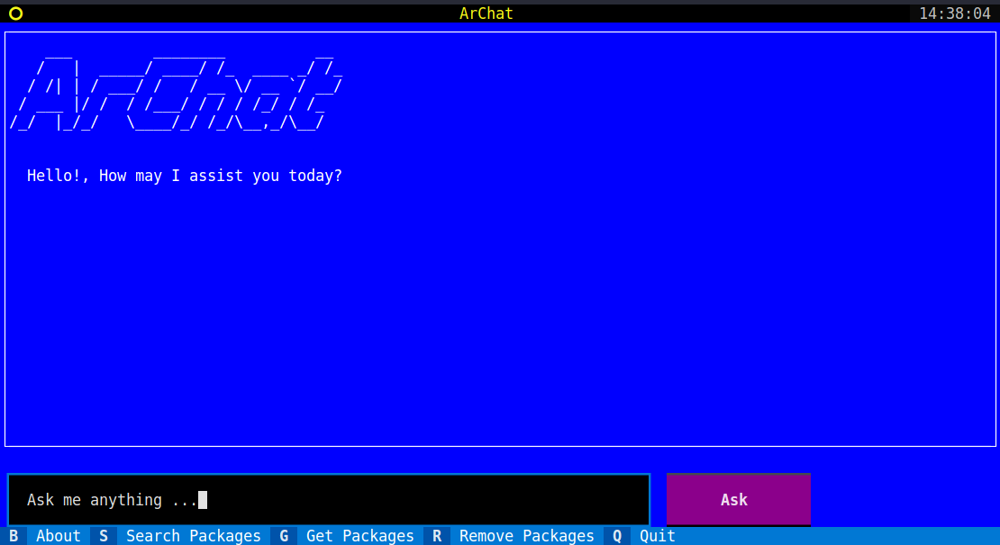

# ArChat

<p align="center">
  <a href="https://github.com/CryptLabs/ArChat">
    
  </a>

  <h3 align="center">ArChat</h3>

  <p align="center">
    <br/><br/> Your Terminal Friendly Arch Linux AI Chat Assistant!<br/>
    <br/>
    <br/>
    <br/>
    <br/>
    <a href="https://github.com/CryptLabs/ArChat/issues">Report Bug</a>
    .
    <a href="https://github.com/CryptLabs/ArChat/issues">Request Feature</a>
  </p>
</p>

  

## Table Of Contents

- [About the Project](#about-the-project)
- [Built With](#built-with)
- [Getting Started](#getting-started)
  - [Prerequisites](#prerequisites)
  - [Installation](#installation)
- [Usage](#usage)
- [Roadmap](#roadmap)
- [Contributing](#contributing)
- [Authors](#authors)

## About The Project

Arch Linux can be challenging for new users due to its minimalistic and do-it-yourself approach. The installation process requires manual configuration and a good understanding of Linux systems. Additionally, troubleshooting and finding relevant information from the official ArchWiki documentation can be time-consuming for both new users and experienced administrators.

ArChat aims to simplify the Arch Linux experience by providing a terminal-friendly AI Chat Assistant. It leverages data from the official ArchWiki documentation to provide fast and easy support for new users, administrators, and programmers. With ArChat, users can quickly access information, troubleshoot issues, and find solutions without the need for a desktop environment or a browser.

The key benefits of ArChat include:

- Terminal-friendly: ArChat runs directly on the terminal, making it accessible even without a graphical user interface.
- Remote access: ArChat can be accessed remotely over SSH, allowing users to get support from anywhere.
- Offline capability: ArChat can be used locally without an internet connection, ensuring uninterrupted access to documentation and support.
- Enhanced knowledge: ArChat utilizes data from the official ArchWiki documentation, providing accurate and comprehensive answers to Arch Linux-related questions.
- Modular design: ArChat supports different language models, allowing users to customize and extend its capabilities.
- Simplified installation: ArChat provides step-by-step instructions and examples to help users set up their Arch Linux environment.
- Simplified installation: ArChat provides step-by-step instructions and examples to help users set up their Arch Linux environment.

By combining the power of AI and the wealth of information available in the Arch Linux ecosystem, ArChat enhances the user experience by providing fast, easy, and simple support for new users, administrators, and programmers.

More features will be added in future updates to further enhance the user experience.

## Built With

- Python 3.12
- The LangChain Framework
- ChromaDB

## Getting Started

To get a local copy up and running follow these simple example steps.

### Prerequisites

To install the dependencies from the requirements.txt file, you can use the pip install -r command.

`pip install -r requirements.txt`

Set your OpenAI API Key in your environment:

**Option 1:** Set your ‘OPENAI_API_KEY’ Environment Variable using zsh

1. Run the following command in your terminal, replacing yourkey with your [API key](https://beta.openai.com/account/api-keys).

`echo "export OPENAI_API_KEY='yourkey'" >> ~/.zshrc`

`echo "export OPENAI_ORGANIZATION_ID='CL'" >> ~/.zshrc`

2. Update the shell with the new variable:

`source ~/.zshrc`

3. Confirm that you have set your environment variable using the following command.

`echo $OPENAI_API_KEY`

The value of your API key will be the resulting output.

**Option 2:** Set your ‘OPENAI_API_KEY’ Environment Variable using bash

Follow the directions in Option 1, replacing **.zshrc** with **.bash_profile.**

You’re all set! You can now reference the key in curl or load it in your Python:
```
import os  
import openai  
   
openai.api_key = os.environ["OPENAI_API_KEY"]
```


The instructions for preparing the ArchWiki documentation dataset for ingestion:

1. **Setup**:
   Ensure you have the wikiteam3 tool installed. This is for downloading and preserving MediaWiki based Wikis.

2. **Installation**:
   If you don't have the wikiteam3 tool, install it using the following command:
   ```
   pip install wikiteam3 --upgrade
   ```

3. **Data Dump**:
   Use the following command to dump the data from the ArchWiki documentation:
   ```
   wikiteam3dumpgenerator https://wiki.archlinux.org --xml --curonly --namespaces 0
   ```

4. **Check Data Location**:
   Verify that the downloaded data is located in the /data folder in the ArChat project.

5. **Run Ingest.py**:
   Execute ingest.py to create the vector embeddings and store them in ChromaDB. 


### Installation

## Usage



## Roadmap

See the [open issues](https://github.com/CryptLabs/ArChat/issues) for a list of proposed features (and known issues).

## Contributing

Contributions are what make the open source community such an amazing place to be learn, inspire, and create. Any contributions you make are **greatly appreciated**.

- If you have suggestions for adding or removing projects, feel free to [open an issue](https://github.com/CryptLabs/ArChat/issues/new) to discuss it, or directly create a pull request after you edit the _README.md_ file with necessary changes.
- Please make sure you check your spelling and grammar.
- Create individual PR for each suggestion.

### Creating A Pull Request

1. Fork the Project
2. Create your Feature Branch (`git checkout -b feature/AmazingFeature`)
3. Commit your Changes (`git commit -m 'Add some AmazingFeature'`)
4. Push to the Branch (`git push origin feature/AmazingFeature`)
5. Open a Pull Request

## Author

- **Ali A. Reihani** - [CryptLabs](https://cryptlabs.com)

## Paper

"The Role of Artificial Intelligence in Utilising Open-Source Information for Enhancing User Experience in Linux Distributions: A Case Study of Arch Linux"

This project was the result of this study at the University of York, United Kingdom.
