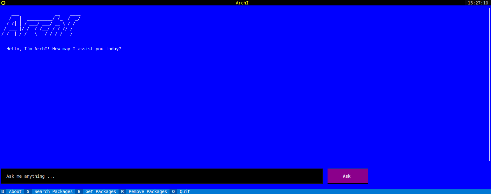

# ArchI

  

  <h3 align="center">ArchI</h3>

  

    Arch + AI = ArchI   Your Terminal Friendly Arch Linux AI Assistant! 
     
     
     
     
    <a href="https://github.com/CryptLabs/Archi/issues">Report Bug</a>
    .
    <a href="https://github.com/CryptLabs/Archi/issues">Request Feature</a>
  

    

## Table Of Contents

* [About the Project](#about-the-project)
* [Built With](#built-with)
* [Getting Started](#getting-started)
  * [Prerequisites](#prerequisites)
  * [Installation](#installation)
* [Usage](#usage)
* [Roadmap](#roadmap)
* [Contributing](#contributing)
* [Authors](#authors)

## About The Project
Arch Linux can be challenging for new users due to its minimalistic and do-it-yourself approach. The installation process requires manual configuration and a good understanding of Linux systems. Additionally, troubleshooting and finding relevant information from the official ArchWiki documentation can be time-consuming for both new users and experienced administrators.

ArchI aims to simplify the Arch Linux experience by providing a terminal-friendly AI assistant. It leverages data from the official ArchWiki documentation to provide fast and easy support for new users, administrators, and programmers. With ArchI, users can quickly access information, troubleshoot issues, and find solutions without the need for a desktop environment or a browser.

The key benefits of ArchI include:
- Terminal-friendly: ArchI runs directly on the terminal, making it accessible even without a graphical user interface.
- Remote access: ArchI can be accessed remotely over SSH, allowing users to get support from anywhere.
- Offline capability: ArchI can be used locally without an internet connection, ensuring uninterrupted access to documentation and support.
- Enhanced knowledge: ArchI utilizes data from the official ArchWiki documentation, providing accurate and comprehensive answers to Arch Linux-related questions.
- Modular design: ArchI supports different language models, allowing users to customize and extend its capabilities.
- Simplified installation: ArchI provides step-by-step instructions and examples to help users set up their Arch Linux environment.
- Simplified installation: ArchI provides step-by-step instructions and examples to help users set up their Arch Linux environment.

By combining the power of AI and the wealth of information available in the Arch Linux ecosystem, ArchI enhances the user experience by providing fast, easy, and simple support for new users, administrators, and programmers.

More features will be added in future updates to further enhance the user experience.

## Built With

* Python
* Langchain
* Chroma

## Getting Started

To get a local copy up and running follow these simple example steps.

### Prerequisites

`install

### Installation

## Usage

## Roadmap

See the [open issues](https://github.com/CryptLabs/Archi/issues) for a list of proposed features (and known issues).

## Contributing

Contributions are what make the open source community such an amazing place to be learn, inspire, and create. Any contributions you make are **greatly appreciated**.
* If you have suggestions for adding or removing projects, feel free to [open an issue](https://github.com/CryptLabs/Archi/issues/new) to discuss it, or directly create a pull request after you edit the *README.md* file with necessary changes.
* Please make sure you check your spelling and grammar.
* Create individual PR for each suggestion.
* Please also read through the [Code Of Conduct](https://github.com/CryptLabs/Archi/blob/main/CODE_OF_CONDUCT.md) before posting your first idea as well.

### Creating A Pull Request

1. Fork the Project
2. Create your Feature Branch (`git checkout -b feature/AmazingFeature`)
3. Commit your Changes (`git commit -m 'Add some AmazingFeature'`)
4. Push to the Branch (`git push origin feature/AmazingFeature`)
5. Open a Pull Request

## Authors

* **Ali A. Reihani** - [CryptLabs](https://cryptlabs.com)